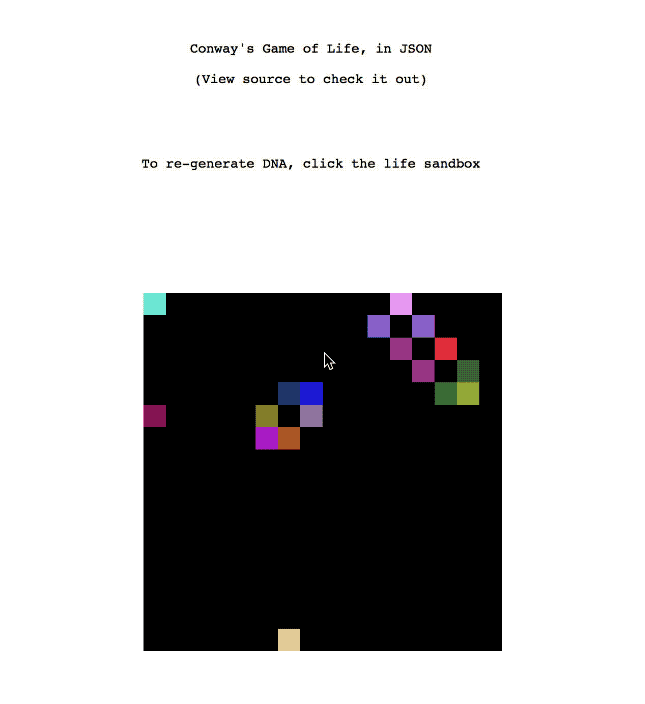
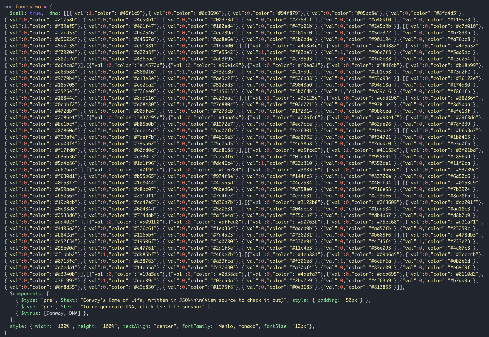

# Conway's Game of Life in JSON

This web app is an attempt at creating a [Conway's game of life](https://en.wikipedia.org/wiki/Conway%27s_Game_of_Life) from a JSON markup.

The app is powered by [cell.js](https://www.celljs.org), which enables the JSON based approach to building web apps.

Also it takes advantage of the [$virus](https://github.com/intercellular/cell/blob/develop/VIRUS.md) feature of `cell.js` to further abstract the logic, so that the final application is a pseudo-JSON markup.

# Demo

Try out the demo at [https://intercellular.github.io/conway/](https://intercellular.github.io/conway/)

# How it works

The application is at [index.html](index.html) and is mostly in a JSON format.

The entire app fits in a single JSON object:

To facilitate this abstraction we use two [$virus](https://github.com/intercellular/cell/blob/develop/VIRUS.md):

1. [conway.virus.js](conway.virus.js): Generates the game of life sandbox DOM.
2. [dna.virus.js](dna.virus.js): Re-generates the "DNA" sequence from which the conway's game of life builds itself.
